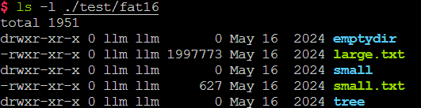

# 实验四   FAT文件系统的实现

## 实验目标

* 熟悉文件系统的基本功能与工作原理（理论基础）
* 熟悉FAT16的存储结构，利用FUSE实现一个FAT文件系统：
  * 熟悉 FUSE 的基本使用，实现一个简单的文件系统
  * 根目录下，文件与目录的读操作、创建操作（仅根目录文件系统，基础）
  * 非根目录下的文件与目录的读、创建操作（进阶）
  * 文件与目录的删除操作（进阶）
  * 文件的写操作（进阶）
  

## 实验环境

* VMware / VirtualBox
* OS: Ubuntu 24.04 LTS
* Linux内核版本: 5.9.0+
* libfuse3

## 实验时间安排

注：此处为实验发布时的安排计划，请以课程主页和课程群内最新公告为准

- 5月23日晚实验课，讲解实验四并检查实验
- 5月30日晚实验课，检查实验
- 6月6日晚实验课，检查实验
- 6月13日晚实验课，检查实验（实验检查截止）

## 实验报告及实验代码提交

- 提交代码文件 `simple_fat16.c`

- 提交你的实验报告（推荐为 PDF 格式）

- 上传至 [BB系统](https://www.bb.ustc.edu.cn/)


## 快速开始


### 实验内容简介

本次实验要求你使用 FUSE 实现一个简单的 FAT16 文件系统。

如图，具体地说，助教提供的代码，用一个格式化为 FAT16 文件系统的镜像文件模拟了磁盘的行为，你只能通过助教提供的`sector_read`、`sector_write`函数**以扇区为粒度**访问该镜像文件。你需要通过读写扇区，访问和维护模拟磁盘中的文件系统结构，实现 FAT16 文件系统的基本功能，例如：读取文件系统中的目录（`readdir`）、读取文件内容`read`、创建和删除文件或目录（`mknod/unlink/mkdir/rmdir`）、写文件（`write`）等。

为了方便实验，我们采用了 FUSE3 作为我们的实验平台，并将实验分为了三个阶段：

1. FUSE 的基本用法
2. FAT16 根目录操作
3. FAT16 完整操作

在第一阶段中，你需要阅读、编译并运行助教提供的`hello.c`文件，学习如何使用 FUSE3 编写文件系统并实际使用，然后为这个简单的系统添加一个文件。

在后两个阶段中，你将逐步实现一个较为完整的 FAT16 系统。为此，你需要完成 `simple_fat16.c` 中格式为`fat16_*`的各个函数的功能。为了降低实验难度，助教已经编写了大部分文件系统代码，你只需要按注释补全剩余部分即可。需要补全的代码已在注释中用 `TODO`标明，并有相应标号，你可以按顺序完成。

助教为文件系统编写了自动测试，你可以使用测试脚本来判断文件系统各个功能是否正确实现。

### 编译、测试方法简介

为方便大家编写代码和测试，我们将环境配置、代表编译和运行的方法总结如下：

在编译前，你需要使用`apt install`安装以下软件包（可能需要`sudo`权限）：

* `fuse3`, `libfuse3-dev`, `pkg-config`, `python3`,`python3-pytest`


实验代码分为四个目录`1-fuse-hello`，`2-simple-fat16-root`，`3-simple-fat16`和`test`，前三个目录对应三个阶段的代码，`test`目录则是用于后两个阶段自动测试的相关代码。

#### 第一阶段编译和运行

在`1-fuse-hello`中有唯一一个源文件`hello.c`，你可以通过`make`或`gcc hello.c -o hello -lfuse3`来编译可执行文件`hello`。然后，你可以通过以下命令，将编译好的文件系统挂载到`hi`目录：

```bash
mkdir hi  # 建立一个新目录，作为挂载点
./hello -f hi  # 文件系统成功运行并挂载至./hi
```

然后，不要关闭上述终端，打开一个新终端：

```bash
ls hi  # 查看./hi目录里的文件，应该会输出唯一一个文件 hello
cat hi/hello # 输出 ./hi/hello 里的文件内容，预计输出 Hello, World!
```

补充完`hello.c`的代码后，你也可以用类似方法测试你新添加的文件。

#### 第二、三阶段编译和运行

第二、三阶段代码结构和运行方法完全一致，第二阶段仅是为了降低代码阅读难度，将完整FAT16中，第二阶段不涉及的代码删去，形成一份较为简单的版本。第二阶段所需补充的代码和第三阶段的前4个任务点完全相同，因此，**如果你不在意代码阅读难度，也可以直接完成第三阶段，即`3-simple-fat16`中的内容**。以下仅以`3-simple-fat16`为例介绍使用方法，要运行第二阶段，替换为`2-simple-fat16-root`即可。

在`3-simple-fat16`目录下，使用`make`编译程序；并使用`../test/build_image.sh ../test/fat16.img`构建测试镜像（虚拟硬盘）。

然后，使用`./simple_fat16 -s -f ../test/fat16/ --img=../test/fat16.img`，即可将镜像文件`fat16.img`挂载到`../test/fat16`目录下。你可以打开另一个终端，进入这个目录运行`ls`等命令进行简单测试。在运行`./simple_fat16`的终端中，会打印文件操作信息。

为了简化测试，助教编写了自动化脚本进行自动测试，在`3-simple-fat16`目录下运行`../test/run_test.sh`即可自动完成上述步骤并完成测试。

当实现的文件系统有 Bug 时，可能会导致终端卡死、无法终止进程等问题，这时候可以使用以下命令强制取消挂载：

```bash
fusermount3 -zu ../test/fat16  # 将../test/fat16换为你挂载的目录
```

如果你的文件系统在测试中出现问题，你可以用以下方法手动挂载，并运行测试，以**看到你的程序的输出**，以更好地调试你的程序：

* 在第一个终端中，运行`../test/run_mount.sh`，这将生成一个测试镜像，并运行你的程序，将其挂载至`../test/fat16`目录。（请不要关闭这个终端，你的程序就输出在这里 ）
* 在另一个终端中，运行`../test/run_test_alone.sh`，这个脚本将独立运行测试，并显示测试结果。
* 或者，在另一个终端中，手动进入`../test/fat16`目录，通过`ls`，`cat`等命令手动测试，并观察第一个终端中的输出。

### 友情提示

- **本次实验总工作量较大，又值期末，请尽早开始实验。**
- <font color=red>**本次实验有400余行注释，注释量超过代码量的1/3，代码实现过程中务必注意看注释！看注释！看注释！**</font>
- 实验多个任务难度梯度较大，靠前的任务代码提示较为详尽，且分值较高，你可以相对容易地获得这部分分数。
- 本实验文档可能不够详尽，如果你有什么疑问，可以在[在线文档](https://docs.qq.com/sheet/DU1JrWXhKdFFpWVNR?nlc=1&tab=l8urls)中提出，或联系助教询问，我们后续可能会更新实验文档，请注意群通知。

## 第一部分 FUSE 简介及编程指南

本次实验要求大家实现一个文件系统，但是，完整的文件系统实现会涉及 kernel 中的诸多细节（如块设备的使用、文件系统相关系统调用、内核中内存分配等等）。为了不过多接触 kernel 中的实现细节，聚焦于文件系统的逻辑，但又能让同学们在系统中实际使用自己实现的文件系统，我们采用了 FUSE 框架来实现我们的文件系统。因此，这一部分中，我们将简单介绍 FUSE 及其使用方法，并尝试在示例的文件系统中，添加一个文件。

### 1.1 FUSE简介

#### 1.1.1 为什么需要 FUSE

通常来说，为了给操作系统编写新的文件系统，我们需要修改内核源代码并重新编译内核（类似实验一），或者编写一个[内核模块](https://wiki.archlinuxcn.org/wiki/内核模块)。这是因为 Linux 的文件系统都建立在 [虚拟文件系统（VFS）](https://zhuanlan.zhihu.com/p/69289429) 之上，通过调用内核中 VFS 的接口来实现功能。

然而，直接在 VFS 上实现文件系统需要熟悉复杂的内核编程（相信大家为内核添加系统调用时有所体会），并涉及大量内核代码的阅读。本次实验着重于让大家理解文件系统的结构，因此，我们希望尽可能清晰地展示文件系统的运行逻辑，而非其和内核实际交互的过程。FUSE 提供了在用户空间中实现文件系统的可能，并将文件系统抽象为多个易于理解的接口，因此我们选用其作为我们的实验平台。

> 如果你还想了解内核中文件系统是如何实现的，可以参考内核源码下`fs`子目录中的代码，例如[内核中的 FAT 代码](https://elixir.bootlin.com/linux/v6.14.7/source/fs/fat)。其实，助教实现本实验的代码时，也一定程度上参考了该部分内核源码。当然，该部分源码十分复杂，想直接从中找到实验要补充代码的答案是不可能的。

#### 1.1.2 FUSE 功能和原理简介


* FUSE（Filesystem in Userspace，用户态文件系统）是一个实现在用户空间的文件系统框架，通过FUSE内核模块的支持，使用者只需要根据fuse提供的接口实现具体的文件操作就可以实现一个文件系统。 
* FUSE主要由三部分组成：FUSE内核模块、用户空间库libfuse以及挂载工具fusermount：

  1. fuse内核模块：实现了和VFS的对接，实现了一个能被用户空间进程打开的设备。
  2. fuse库libfuse：负责和内核空间通信，接收来自/dev/fuse的请求，并将其转化为一系列的函数调用，将结果写回到/dev/fuse；提供的函数可以对fuse文件系统进行挂载卸载、从linux内核读取请求以及发送响应到内核。
  3. 挂载工具：实现对用户态文件系统的挂载。
* 更多详细内容可参考[这个文章](https://zhuanlan.zhihu.com/p/143256077)。

**更简单地说**，FUSE 能实现什么功能呢？具体来说，它能将对使用 FUSE 挂载的目录的访问（系统调用，如`read`，`write`等），转换为对我们代码中的用户态函数的访问（如我们提供的`simple_fat16.c`代码中的`fat16_read`和`fat16_write`函数等 ）。也就是说，我们只要像平时编写用户态 C 程序那样，实现几个接口函数，就可以在不接触内核底层细节（如 VFS等），不重新编译内核的情况下，直接实现并使用一个文件系统了。

### 1.2 配置和测试 FUSE 环境

linux kernel在2.6.14后添加了FUSE模块，因此对于目前的大多数发行版来说只需要安装libfuse库即可。本实验使用fuse3，请使用以下命令安装libfuse3，和实验需要的其它库：

```bash
sudo apt install libfuse3-dev pkg-config python3 python3-pip fuse3 python3-pytest
```

本次实验在`1-fuse-hello`目录下提供了`hello.c`，该文件使用 FUSE 实现了一个简单的只读的文件系统，文件系统下只有一个 hello 文件，可以用于测试 fuse 是否正确安装。测试方法如下（在`1-fuse-hello`目录下运行）：

```bash
make hello # 编译 hello 文件系统
mkdir hi   # 建立一个空目录作为挂载点
./hello -f hi  # 运行 hello，挂载至 hi 目录
```

上述程序运行后，在另一个终端同一目录下运行：

```bash
ls hi
# 输出 hello
cat hi/hello         
# 输出 Hello World!
```

说明 FUSE 安装成功。

> 仔细观察我们上述实验过程的花，我们会发现实现的效果很神奇，创建了一个空目录`hi`，并将其作为参数传递到`hello`里运行后，这个空的`hello`目录下居然出现了一个文件`hi`。难道这个文件是`hello`创建的吗？但如果阅读`hello.c`，里面似乎也没有任何创建文件的代码。这是为什么呢？
>
> 实际上，这里的`hello`就实现了一个文件系统，运行`hello`将文件系统**挂载**到了`hi`目录下，而`hi/hello`这个文件，实际上是挂载的文件系统里的文件。接下来，我们就将详细介绍挂载，以及文件系统需要支持的操作。

### 1.3 FUSE的使用逻辑：挂载和挂载点

在上文中，我们多次提到**挂载**，例如，在上一步中，我们创建了空目录`hi`，将`hello`文件系统挂载到`hi`目录下，本来应该是空目录的`hi`里，就神奇的出现了`hello`这个文件。这是为什么呢？

实际上，**挂载**是指 linux 上使存储设备（例如硬盘、CD等）上的文件和目录可供用户通过计算机的文件系统访问的过程。这个过程把一个文件系统连接到了另一个文件系统的某个目录下。

为什么需要挂载呢？想想我们在使用 Windows 时，可以有多个磁盘，通过磁盘标识符（`C:`、`D:`...）来访问不同的磁盘。但在 linux 中，我们只有一个根目录，根目录下文件也并不是按磁盘分类的，那如果我们有两块磁盘怎么办？挂载就是解决这个问题的一种方式，例如根目录在磁盘 A 上（相当于 Windows 中的 C 盘），则我们存储在 `/`下的所有文件实际都存放在磁盘 A 上。然后假设**我们将磁盘 `B` 挂载到`/data`下**，注意，这里`/data`需要是磁盘 A 中的一个 **空目录**，称为**挂载点**。之后，**我们访问 `/data` 下的文件时，实际上就访问了磁盘 B**（和上面的文件系统），创建的文件实际也会存储在 B 中。这样，我们就能通过唯一的根目录`/`访问不同的磁盘或者其它存储设备。

在本次实验中的后两个阶段，我们的镜像文件就是一个存储设备，其中保存了 FAT16 格式的文件数据（第一阶段的示例中，没有额外的存储设备，文件内容就写在源代码里）。实验中，我们会将其挂载到`./test/fat16`目录下，此时访问该目录，就能够访问到我们的文件系统。运行我们的程序时，fuse实际上就进行了挂载操作，而程序结束时，该操作被卸载。因此，在程序运行时，我们能访问镜像文件中的数据，而程序结束后，`./test/fat16`只是根文件系统下一个空文件夹而已，此时我们再访问这个文件夹，再里面创建文件等，就与`simple_fat16`无关了。（因为挂载要保证挂载点是空目录，所以在程序结束后，不要在`./fat16`中创建文件，这样会导致下次运行程序失败。如果不小心创建了文件，只需要清空该文件夹再运行程序即可。）

### 1.4 FUSE的使用逻辑：从 hello 开始

#### 1.4.1 文件系统再认识

了解了挂载以后，我们将介绍`hello.c`是如何实现的。首先，我们来再次思考一个问题：**什么是文件系统？**在理论课堂上，我们学到了关于文件系统的理论知识，但同学们可能还是对实践中的文件系统没有直观的认识。也许，我们可以从另外一个角度思考这个问题：**文件系统应该支持哪些操作呢？**

回想我们平时使用 Windows / Linux 浏览、查看文件、编写代码时操作，很容易想到，文件系统至少应该支持以下这些功能：

* `readdir`：给定一个目录，获取这个目录下有哪些文件
* `read`：给定一个文件，读取这个文件的内容
* `getattr`：给定一个路径，获取这个路径的文件类型（是目录还是文件）、创建时间、访问权限等相关属性
* `mknod/mkdir`：创建一个文件或者目录
* `unlink/rmdir`：删除一个文件或者目录
* `write`：给定一个文件，往这个文件里写入指定的内容
* ……

所以反过来说，我们也可以简单理解为，**一个支持上面这些操作的程序，就是一个文件系统**。

这其实也是使用 FUSE 编写文件系统的逻辑，在`hello.c`中，我们实现了`hello_getattr`，`hello_readdir`，`hello_read`三个函数，并通过`fuse_operations`结构体告诉 FUSE，这三个函数分别对应文件系统的`getattr`（读属性），`readdir`（读目录）和`read`（读文件）操作，FUSE 就能理解如何正确使用这些函数，并自动与内核沟通，在合适的时候掉用这些函数，使其成为一个真正的文件系统。

> 由于`hello`中只实现了读相关的操作，试图在**挂载后**的`hi`目录写入或者创建文件/目录，都会失败。大家可以自行尝试，例如运行`mkdir hi/newdir`。

#### 1.4.1 文件操作到 FUSE 函数的转换：以`ls`为例

上文提到，FUSE会在适当时候调用函数，那么具体什么时候，相应的函数会被调用呢？

简单的回答是，文件相关的系统调用被使用时，相应的函数会被调用。但这个回答不够直观，我们就以`ls`命令为例，展示`hello`文件系统中，函数被调用的过程。

我们都知道，`ls`命令的功能是列出目录下的文件。看上去，这个功能似乎只需要`readdir`就能完成，然而，实际上单一的shell命令/程序通常会调用多个FUSE里的函数，来实现目标。例如，`ls`命令会根据文件类型（目录还是文件）以及文件权限**将输出染成不同颜色**，但`readdir`本身只提供了每个文件（或目录）的文件名。因此，`ls`命令在获得目录下每个文件名后，会依次对每个文件调用`getattr`，获得其属性。

如下是挂载`hello`程序到`hi`目录后，一次`ls ./hi`后，`./hello`程序的输出（你可以在运行`./hello`的终端上看到这些输出，这些输出是`hello.c`代码中的`print_log`打印的）：

```bash
[15:44:32] getattr(path=/)
[15:44:32] readdir(path=/)
[15:44:32] getattr(path=/hello)
```

可以看到，一次`ls`操作实际上调用了3个函数（`getattr`2次,`readdir`1次，你可以在`hello.c`中找到这两个函数的定义）。

> 如果其中某些函数出错，就会使得命令出现奇怪的错误。例如，`readdir`正常返回了一个文件名`hello`，但`getattr`时，文件系统却提示找不到`hello`，这时候`ls`就可能出现显示了`hello`但同时提示找不到`hello`的错误。
>
> 在我们后续实现的 FAT16 文件系统中，这样的错误很常见。特别是`find_entry`函数（见后续文档介绍）实现出错时，很容易出现这样的现象。

因此，在调试时，我们要首先搞清楚我们的操作对应到哪些程序中的函数。我们可以通过在每个函数前加上`printf`，来判断哪些函数被调用了。（在提供代码的大部分函数前，已经写好了这样一条`printf`（在`hello.c`中是`print_log`），但也有些函数没有，可以自行加入。）你可以使用上节提到的`-f`而不是`-d`参数运行程序，使得输出更清晰。

#### 1.4.2 FUSE的路径转换

在上一节中，我们发现，虽然我们运行的命令是`ls ./hi`，但被调用的`readdir`的参数却是`readdir(paht=/)`而不是`readdir(path=./hi)`。实际上，这是 FUSE 为了文件系统实现的遍历，会自动将路径换为，**以挂载点为根目录的绝对路径**。例如，如果运行`cat ./hi/hello`，那么实际上会调用`read(path=/hello, ...)`。

`path`是几乎所有文件系统操作都会使用到的参数，正确理解传入的`path`对实现文件系统很重要。

### 1.5 FUSE 程序参数的意义

在运行`hello`这个示例文件系统时，我们使用了以下命令：

```bash
./hello -f hi
```

这里，`-f`参数表示以 **前台** 模式运行程序，即程序会占用当前终端，并把输出显示到当前终端。而`hi`则表示上文所说的**挂载点**。我们的程序中，似乎并没有处理这些参数，那这些参数是怎么被使用的呢？实际上，**这些参数会传递给`fuse_main`函数，由 FUSE 自动处理。**

同时，在**快速开始**的说明中，我们提到可以用以下方法运行程序：（注意，你首先得调用`./test/build_image.sh ./test/fat16.img`来建立一个 FAT16 的镜像。）

```bash
./simple_fat16 -s -f ./test/fat16/ --img=./test/fat16.img
```

这里`-f`和`./test/fat16/`的意义和上面类似，`-s`则指定文件系统是单线程的`--img`指示镜像位置。

**为什么我们要以`-f`模式运行程呢？**实际上该参数会将程序保持在前台运行。如果去掉该参数，我们的文件系统将自动运行在**后台**，我们无法判断程序的运行状态（例如程序是否异常终止，是陷入死循环还是返回了错误，在程序中`printf`到标准输出（STDOUT）时，我们**也无法看到输出内容**）。通过 `-f` 参数，我们能像运行普通 C 程序一样运行我们的文件系统程序，并观察程序输出。

如果你想查看 FUSE 自带的一些调试信息，也可以使用`-d`参数开启 FUSE 的 Debug 模式。这样会自带一些 FUSE 输出的调试信息，但 FUSE 本身的调试信息比较晦涩，所以我们**不推荐**使用此种方式运行程序。

```bash
./simple_fat16 -s -d ./test/fat16/ --img=./test/fat16.img
```

实际上，我们提供的`hello.c`和 `simple_fat16.c` 中，已经将FAT16 接口函数的调用（以及调用时的参数）打印出来了。使用`-f`参数就能很清楚的看到系统实在什么位置出错的。 

### 1.6 为 hello 文件系统添加一个文件

这一节中，你需要为修改`hello.c`中的`getattr`，`readdir`，`read`三个函数，为文件系统添加一个**以你学号命名的文件**，文件内容也是你的学号。需要补充代码的部分已在`hello.c`中用 TODO 展示。（你也可以在TODO外加入代码，但这不是必须的。）

你可以参考`hello.c`中对每个函数的注释，并参考已有代码，来了解每个函数的具体功能和实现方式。注释包含三个部分：1. 函数功能简介`@brief`；2. 参数含义描述`@param`；3. 返回值含义描述`@return`。例如，`readdir`的注释如下：

```c
/**
 * @brief 获取 path 对应的目录里的文件（子目录）列表，结果使用 filler 函数填充到 buf 中。
 *        其它参数可以忽略。
 * 
 * @param path		要读取的目录路径 
 * @param buf 		结果缓冲区（通过 filler 函数使用）
 * @param filler 	用于填充结果的函数，使用方法：filler(buf, "apple", NULL, 0, 0)，意为目录下有名为 apple 的文件。
 * @return int 		成功返回0，失败返回负数（POSIX错误代码的负值）
 */
static int hello_readdir(const char *path, void *buf, fuse_fill_dir_t filler,
			off_t offset, struct fuse_file_info *fi, enum fuse_readdir_flags flags)
```

上面的注释中，`@brief`介绍了`fat16_readdir`的主要工作——找到`path`对应目录并读取目录内容，并调用`filler`函数把各目录名写入`buf`中。各个`@param`解释了接口中的参数——读取的目标路径`path`、返回给上层调用的缓冲区`buf`、完成缓冲区填充的函数指针`filler`（由调用函数提供）。参数`offset`、`fi`和`flags`实验中不会被用到，可忽略。最后，`@return`解释返回值含义，比如在这里0为成功返回的tag，否则负数（对应一个POSIX错误代码，会影响终端上显示的错误）。

实现完成后，你可以按照[1.2节](#1.2 配置和测试 FUSE 环境)中的方法测试你的程序，查看是否能显示以你学号命名的文件。

> 即：终端一运行`mkdir hi`,`make`和`./hello -f hi`；终端二运行`ls ./hi`,`cat ./hi/[你的学号]`

## 第二部分 FAT文件系统介绍

接下来，我们将尝试实现自己的 FAT16 文件系统。在**第二部分**，我们将介绍 FAT 文件系统的背景概念；**第三部分**，我们将介绍 FUSE 中各个操作的逻辑；而在**第四部分中，将介绍需要完成的具体任务**。

### 2.1 FAT文件系统初识

FAT(File Allocation Table)是“文件分配表”的意思。顾名思义，就是用来记录文件所在位置的表格，它对于硬盘的使用是非常重要的，假若丢失文件分配表，那么硬盘上的数据就会因无法定位而不能使用了。不同的操作系统所使用的文件系统不尽相同，在个人计算机上常用的操作系统中，MS-DOS 6.x及以下版本使用FAT16。操作系统根据表现整个磁盘空间所需要的簇数量来确定使用多大的FAT。所谓簇就是磁盘空间的配置单位，就象图书馆内一格一格的书架一样。FAT16使用了16位的空间来表示每个扇区(Sector)配置文件的情形，故称之为FAT16。
从上述描述中我们够得知，一个FAT分区或者磁盘能够使用的簇数是2^16=65536个，因此簇大小是一个变化值，通常与分区大小有关，计算方式为：(磁盘大小/簇个数)向上按2的幂取整。在FAT16文件系统中，由于兼容性等原因，簇大小通常不超过32K，这也是FAT分区容量不能超过2GB的原因。

### 2.2 专有名词

| 名词 | 释义                                                         |
| ---- | ------------------------------------------------------------ |
| 簇   | 文件的最小空间分配单元，通常为若干个扇区，每个文件最小将占用一个簇 |
| 扇区 | 磁盘上的磁道被等分为若干个弧段，这些弧段被称为扇区，硬盘的读写以扇区为基本单位。常见的系统中，一个逻辑扇区为 512B。 |

### 2.3 磁盘分布

<table >
    <tr align="center">
        <td colspan="8">一个FAT分区或磁盘的结构布局</td>
    </tr>
    <tr align="center">
        <td>内容</td>
        <td>主引导区</td>
        <td>文件系统信息扇区</td>
        <td>额外的保留空间</td>
        <td>文件分配表1(FAT表1)</td>
        <td>文件分配表2(FAT表2)</td>
        <td>根目录(Root directory)</td>
        <td>数据区()</td>
    </tr>
    <tr align="center">
        <td>大小(Bytes)</td>
        <td colspan="3">保留扇区数*扇区大小</td>
        <td>FAT扇区数* 扇区大小</td>
        <td>FAT扇区数* 扇区大小</td>
        <td>根目录条目数*文件条目大小</td>
        <td>剩下的磁盘空间</td>
    </tr>
</table>


一个FAT文件系统包括四个不同的部分。

* **保留扇区**，位于最开始的位置。 第一个保留扇区是引导扇区（分区启动记录）。它包括一个称为基本输入输出参数块的区域（包括一些基本的文件系统信息尤其是它的类型和其它指向其它扇区的指针），通常包括操作系统的启动调用代码。保留扇区的总数记录在引导扇区中的一个参数中。引导扇区中的重要信息可以被DOS和OS/2中称为驱动器参数块的操作系统结构访问。
* **FAT区域**。它包含有两份文件分配表，这是出于系统冗余考虑，尽管它很少使用。它是分区信息的映射表，指示簇是如何存储的。
* **根目录区域**。它是在根目录中存储文件和目录信息的目录表。在FAT32下它可以存在分区中的任何位置，但是在FAT16中它永远紧随FAT区域之后。
* **数据区域**。这是实际的文件和目录数据存储的区域，它占据了分区的绝大部分。通过简单地在FAT中添加文件链接的个数可以任意增加文件大小和子目录个数（只要有空簇存在）。然而需要注意的是每个簇只能被一个文件占有：如果在32KB大小的簇中有一个1KB大小的文件，那么31KB的空间就浪费掉了。

#### 2.3.1 启动扇区详解

| 名称               | 偏移(字节) | 长度(字节) | 说明                                                         |
| ------------------ | ---------- | :--------: | ------------------------------------------------------------ |
| BS_jmpBoot         | 0x00       |     3      | 跳转指令（跳过开头一段区域）                                 |
| BS_OEMName         | 0x03       |     8      | OEM名称，Windows操作系统没有针对这个字段做特殊的逻辑，理论上说这个字段只是一个标识字符串，但是有一些FAT驱动程序可能依赖这个字段的指定值。常见值是"MSWIN4.1"和"FrLdr1.0" |
| **BPB_BytsPerSec** | 0x0b       |     2      | **每个扇区的字节数。基本输入输出系统参数块从这里开始。**     |
| **BPB_SecPerClus** | 0x0d       |     1      | **每簇扇区数**                                               |
| **BPB_RsvdSecCnt** | 0x0e       |     2      | **保留扇区数（包括主引导区）**                               |
| **BPB_NumFATS**    | 0x10       |     1      | **文件分配表数目，FAT16文件系统中为0x02,FAT2作为FAT1的冗余** |
| **BPB_RootEntCnt** | 0x11       |     2      | **最大根目录条目个数**                                       |
| BPB_TotSec16       | 0x13       |     2      | 总扇区数（如果是0，就使用偏移0x20处的4字节值）               |
| BPB_Media          | 0x15       |     1      | 介质描述：F8表示为硬盘，F0表示为软盘                         |
| **BPB_FATSz16**    | 0x16       |     2      | **每个文件分配表的扇区数（FAT16专用）**                      |
| BPB_SecPerTrk      | 0x18       |     2      | 每磁道的扇区数                                               |
| BPB_NumHeads       | 0x1a       |     2      | 磁头数                                                       |
| BPB_HiddSec        | 0x1c       |     4      | 隐藏扇区数                                                   |
| BPB_TotSec32       | 0x20       |     4      | 总扇区数（如果0x13处不为0，则该处应为0）                     |
| BS_DrvNum          | 0x24       |     1      | 物理驱动器号，指定系统从哪里引导。                           |
| BS_Reserved1       | 0x25       |     1      | 保留字段。这个字段设计时被用来指定引导扇区所在的             |
| BS_BootSig         | 0x26       |     1      | 扩展引导标记（Extended Boot Signature）                      |
| BS_VollID          | 0x27       |     4      | 卷序列号，例如0                                              |
| BS_VollLab         | 0x2B       |     11     | 卷标，例如"NO NAME "                                         |
| BS_FilSysType      | 0x36       |     8      | 文件系统类型，例如"FAT16"                                    |
| Reserved2          | 0x3E       |    448     | 引导程序                                                     |
| Signature_word     | 0x01FE     |     2      | 引导区结束标记                                               |

根据上面的DBR扇区，我们可以算出各FAT的偏移地址，根目录的偏移地址，数据区的偏移地址。

FAT1偏移地址：保留扇区之后就是FAT1。因此可以得到，FAT1的偏移地址就是`BPB_RsvdSecCnt`*`BPB_BytsPerSec`。

根目录偏移地址： FAT1表后两个FAT表地址就是根目录区，即FAT1偏移地址+`BPB_NumFATS`\*`BPB_FATSz16`\*`BPB_BytsPerSec`。

数据区的偏移地址：根目录偏移地址+根目录大小，即根目录偏移地址+`BPB_RootEntCnt`*32。


### 2.4 FAT文件系统磁盘分布详解


在FAT文件系统中，文件分为两个部分，第一个部分为目录项，记录该文件的文件名，拓展名，以及属性，首簇号等元数据信息，注：文件夹也是一种文件，它的目录项和普通文件结构相同；第二部分为实际存储内容，若为文件，则存储文件内容，若为文件夹，则存储子文件夹的文件目录项。

* 例一，文件处于Root目录下 (假设该文件路径为/rock.mp3)
  若文件处于Root目录下，那么该文件的目录项将会存储在`Root Directory`区域中，其中记录了该文件的文件名，拓展名，以及第一个文件簇的地址。
  FAT Table中存储了所有可用的簇，通过簇地址查找使用情况，我们能够得知该文件的下一个簇地址，若下一个簇地址为END标记符，则表示该簇为最后一个簇。通过查询FAT Table，我们能够得知该文件所有簇号。
* 情况二，文件处于Root目录下子文件夹中 (假设该文件路径为/test/file1.txt)，那么可知test目录项在`Root Directory`中，而rock.mp3的目录项将会存储在test文件的数据区域。


#### 2.4.1 文件目录项是如何存储的

文件目录是文件的元数据信息，存储在`Root directory`以及数据区中，下图是两个文件/rock.mp3和 /test/file1.txt的文件目录项存储示例。


**文件的目录项结构**

| 名称              | 偏移(字节) | 长度(字节) | 说明                                               |
| ----------------- | ---------- | :--------: | -------------------------------------------------- |
| **DIR_Name**      | 0x00       |     11     | **文件名（前8个字节为文件名，后3个为拓展名**       |
| **DIR_Attr**      | 0x0B       |     1      | **文件属性，取值为0x10表示为目录，0x20表示为文件** |
| DIR_NTRes         | 0x0C       |     1      | 保留                                               |
| DIR_CrtTimeTenth  | 0x0D       |     1      | 保留(FAT32中用作创建时间，精确到10ms))             |
| DIR_CrtTime       | 0x0E       |     2      | 保留(FAT32中用作创建时间，精确到2s)                |
| DIR_CrtDate       | 0x10       |     2      | 保留(FAT32中用作创建日期)                          |
| DIR_LstAccDate    | 0x12       |     2      | 保留(FAT32中用作最近访问日期）                     |
| DIR_FstClusHI     | 0x14       |     2      | 保留(FAT32用作第一个簇的两个高字节)                |
| DIR_WrtTime       | 0x16       |     2      | 文件最近修改时间                                   |
| DIR_WrtDate       | 0x18       |     2      | 文件最近修改日期                                   |
| **DIR_FstClusLO** | 0x1A       |     2      | **文件首簇号(FAT32用作第一个簇的两个低字节)**      |
| **DIR_FileSize**  | 0x1C       |     4      | **文件大小**                                       |

#### 2.4.2 文件分配表(FAT表)详解

* FAT表由FAT表项构成的，我们把FAT表项简称为FAT项，本次实验中，FAT项为`2`个字节大小。每个FAT项的大小有12位，16位，32位，三种情况，对应的分别FAT12，FAT16，FAT32文件系统。

* 每个FAT项都有一个固定的编号，这个编号是从0开始。

* FAT表的前两个FAT项有专门的用途：0号FAT项通常用来存放分区所在的介质类型，例如硬盘的介质类型为“F8”，那么硬盘上分区FAT表第一个FAT项就是以"F8"开始，1号FAT项则用来存储文件系统的肮脏标志，表明文件系统被非法卸载或者磁盘表面存在错误。

* 分区的数据区每一个簇都会映射到FAT表中的唯一一个FAT项。因为0号FAT项与1号FAT项已经被系统占用，无法与数据区的簇形成映射。因此，数据区的首个簇，对应FAT表的2号表项，或者说，数据区第一个簇就是2号簇。同理，数据区的第二个簇对应3号表项。（所以，计算FAT表中某项对应的簇在数据区的偏移量时，要相应减少两个簇大小。）
 
* 分区格式化后，用户文件以簇为单位存放在数据区中，一个文件至少占用一个簇。当一个文件占用多个簇时，这些族的簇号不一定是连续的，但这些簇号在存储该文件时就确定了顺序，即每一个文件都有其特定的“簇号链”。在分区上的每一个可用的簇在FAT中有且只有一个映射FAT项，通过在对应簇号的FAT项内填入“FAT项值”来表明数据区中的该簇是已占用，空闲或者是坏簇三种状态之一。

##### 取值意义

| 簇取值          | 对应含义                 |
| --------------- | ------------------------ |
| 0x0000          | 空闲簇                   |
| 0x0001          | 保留簇                   |
| 0x0002 - 0xFFEF | 被占用的簇；指向下一个簇 |
| 0xFFF0 - 0xFFF6 | 保留值                   |
| 0xFFF7          | 坏簇                     |
| 0xFFF8 - 0xFFFF | 文件最后一个簇           |

## 第三部分 FAT16系统文件操作逻辑

第二部分中，我们介绍了 FAT16 系统中数据存储结构， 但光说明结构还不足以让我们理解文件系统是怎么运作的。本部分将介绍FAT16文件系统下各文件操作的逻辑，即在文件系统收到操作请求时（如读、写某个文件），具体如何运行来满足这些请求的。这一部分的介绍不涉及具体的代码，本次实验的详细任务要求详见第三和第四部分文档。第三部分将会介绍 FUSE 环境配置和一些实验用到的命令等，第四部分则说明要实现的**实验内容**和**评分标准**和两节。

### 3.1 读目录

顾名思义，读目录操作的含义是遍历一个目录下的所有目录项，并返回各目录项的文件名。在我们在 Shell 中使用的 `ls` 命令，实际上就会调用文件系统的这个接口。所以，完整实现读目录操作，应当能支持**ls**命令。

要完成一个读目录操作，需要完成以下工作：

- 以根目录为起始位置，查找输入路径对应的目录项
- 读取目标目录的内容，遍历其中各目录项，将各文件名放入缓冲区并返回

首先，我们需要介绍第一步——目录项的查找工作。这是文件系统的一个很重要的部分，它完成了文件路径到物理文件位置的索引。所有的目录项查找都需要以根目录为起始位置。总体的思路为：将文件路径以'/'字符分隔为若干目录名（实验二中`split_string`函数），从根目录开始，迭代地在每一层目录中查找对应深度的目录名，直到穷尽文件路径。

如果你还记得**1.3**节我们介绍的FAT文件系统的磁盘分布，你会意识到`Root directory`不同于非根目录，由文件系统单独管理而不属于数据分区。所以上面的迭代查找实际上分为两个部分：1. 读取`Root directory`分区，找到第一层目录的目录项；2. 通过FAT表找到上一层目录的数据分区，读取该部分数据，找到本层目录的目录项。（对于读根目录，由于起点就在根目录，你甚至不需要查找就可以读取目录了）

> 文件读取、创建、删除、写入等操作也都需要先完成目录项查找。

如果你觉得目录项查找过于烧脑，这里会是一个**好消息**：为了使同学们的实验过程更加清晰，我们对实验任务做了拆分——我们首先仅要求大家完成**根目录的读取**。在根目录读取任务中，你只需要完成目录项遍历，而非根目录读取所需要的目录项查找将被放在**后续任务**中。为了降低所需要的代码阅读量，我们将与后续任务无关的代码删除后的代码放置在`2-simple-fat16-root`中，其中`simple_fat16.c`**需要补充的代码和`3-simple-fat16`中前四个任务相同**，你也可以选择直接补全`3-simple-fat16`中的`simple_fat16.c`。

后面我们将要介绍的文件读取、创建等操作也将先安排根目录任务，最后再安排非根目录任务，使同学们能优先关注操作本身。

### 3.2 读文件

文件读取要求能在文件的任意位置开始读取。FAT文件系统要完成一个读文件操作，需要完成以下工作：

* 以根目录为起始位置，查找所读文件对应的目录项
* 根据读取的起始位置和长度，复制对应内容到缓冲区

这里，查找目录项的过程和上面提到的一致。但是，关于文件读取，你需要考虑以下问题：

* 文件可能会很大，需要多于一个簇来存放，且这些簇不保证物理连续。你需要查找FAT表，完成这些簇的读取？

* 磁盘读取以整个扇区为单位，你需要把读取的起始位置、长度转化为对应扇区、扇区内的偏移位置和扇区内长度？

类似**2.1节**所介绍的，我们将这些问题分在了不同的实验任务中。在最初最简单的实验任务里，你只需要读取根目录下的短文件（短文件意味着不需要考虑跨簇读取）。

### 3.3 文件、目录的创建和删除

前文介绍的读目录、读文件都不会修改文件系统本身和磁盘里的内容，这些操作是**只读**的。而平时，除了读取文件系统里的内容，我们还要在文件系统里创建文件、创建目录、修改文件里的内容等。从这一节开始，我们将介绍文件系统的修改。首先，我们将介绍文件、目录的创建和删除。

#### 3.3.1 创建文件

首先，我们来考虑文件系统中创建文件需要完成哪些工作？正如前文介绍 FAT 文件系统结构时讨论的那样，文件本身是作为目录项存储在硬盘里的。因此，新建一个文件件实际上就是创建一个目录项，而则需要完成一下工作：

- 找到新建文件的父目录区域（对应的簇，或者根目录区域）
- 在父目录区域中找到可用的 entry
- 将新建文件的信息填入该 entry

思路似乎很简单，但实现起来有很多细节问题，为了让大家顺利地进行实验，有必要透露更多的细节。你需要思考这些细节问题：

1. 父目录有可能是根目录或者子目录，后续操作是否相同？不同的话分别如何处理？

2. 什么是可用的 entry？如何在目录文件中查找可用的 entry？

3. 一个 entry 记录了很多内容（可以参考 1.4.1 中的目录项结构），在装填entry时我们应该写入哪些内容？

4. 我们只能以扇区为粒度修改镜像（磁盘），但一个entry小于一个扇区，我们如何只修改一个entry？

细心的同学可能会发现一些问题：

1. FAT 16文件系统根目录大小是固定的，也就意味着最多只能有512个entry。如果我在根目录下不断新建文件，超过了512个entry该如何处理呢？

2. 在FAT 16文件系统中，子目录和正常文件一样存放在数据区，这意味着子目录空间是可变的。如果我在某个子目录下新建一个文件，但是空间不够，找不到可用的entry，该怎么办？

对于第1个问题，可以忽略，既然文件系统固定了根目录大小，我们只能避免使用的entry数量不超过512。

第2个问题是可以解决的，我们可以给该子目录分配新的簇，增加该目录文件的空间，自然也就有了可用的entry。但为了控制实验难度，**我们并不做要求**，有余力的同学可以去实现这项功能。

总而言之，上述这两个问题都可以忽略，只要在找到可用entry的时候填入信息即可，如果没找到那就不填，文件创建失败。当然，我们鼓励有余力的同学去解决第2个问题（但没有加分）。

如果你看了源码，还应该注意到，我们创建新文件时，该文件的首簇号我们填入了0。这显然是错误的，但为了简化实验，降低难度，大家掌握创建文件的流程即可。（你也可以自行修改创建时的首簇号，也许0xFFFF也是个不错的选择。）

#### 3.3.2 创建目录（文件夹）

创建文件夹和创建文件的要求很像，但文件夹创建的时候，就包含了`.`和`..`两个目录，因此我们不能像创建文件时那样，不给新目录分配簇。所以，在创建文件夹时，我们也要从FAT16文件系统中找到空簇，并分配给新创建的文件夹，并把`.`和`..`两个特殊的目录写在新文件夹的头两个目录项内。

分配单个空闲簇的流程大致如下： 

1. 在 FAT 表中找到一个未分配的簇（FAT表的内容已经在前文中说明过了）。
2. 将这个分配的簇清零（即把簇对应的所有的扇区都写入0）。 
3. 然后将这个簇从未使用改为使用（即对应的修改 FAT 表）。而修改 FAT 表的方式和前述添加目录项有点类似（代码注释中有更细节的说明）。 

当分配好空闲簇后，我们还要新建两个特殊的目录`.`和`..`。本次实验中，这个过程已经被我们提前实现好了，你可以参考代码，来看看这和普通目录的目录项有什么差别。

当然，我们还需要创建目录本身对应的目录项（放到父目录对应的目录区域中），这一点和新建文件一样。要注意的是，要记得把刚刚分配的簇给写到目录项里，不然下次读这个目录的时候就找不到它对应的簇了！

#### 3.3.3 删除文件/目录

在你实现的文件系统中，需要能够支持删除文件和目录。例如，我们经常要在 shell 里使用`rm`和`rmdir`命令，我们当然也希望我们的文件系统支持这两个命令 。（我们还很常用`rm -r`，事实上，如果支持了`rm`和`rmdir`，你的文件系统同时也就支持了`rm -r`，后者实际上就是递归的调用前面两个指令。）

删除文件和目录的过程看似和创建正好相反，但实际上，FAT 文件系统进行删除时，并不会真的立即删除掉目录项。实际上， 删除一个文件，我们并不需要改变文件具体的内容，而是做一些信息标记，让系统知道该文件已经被删除了以及该文件占有的空间已经被释放了。这里，给出删除文件的思路：

- 释放该文件使用的簇（考虑迭代或递归，修改FAT表项即可）
- 在父目录里释放该文件的entry（做相应的标记）

代码流程上和创建文件很相似，代码中也有相应的注释，不再给予更多的提示。

<font color="red">注意：有些同学可能在添加了创建和删除文件功能后，前面的只读文件系统代码上会出现一些bug（逻辑bug，不会报错的），因人而异，仔细想一想，主要看看在添加功能后，查找文件时判断语句会不会出错！另外，我们的测试功能进行了很复杂的创建和删除操作，如果能通过pytest测试，那么功能上应该没有太大问题。</font>

**删除目录（文件夹）**和删除文件的方式几乎完全一致，但是，要注意的是：要删除的对应的目录<font color="red">**必须存在，且为空目录，否则应该直接返回错误！！！**</font>另外，文件系统的根目录`/`无法被删除。因此，在删除目录前，你需要使用和读目录类似的方法，扫描一遍要删除的目录，确保目录为空（除了`.`和`..`外不存在其它有效的目录项了）。总的来说，删除目录类似读目录 + 删除文件。

### 3.4 写文件

最后，我们来介绍写文件的操作。写文件思路如下： 

1. 找到要写的文件对应的目录项（这样我们就知道文件在哪个簇。） 
1. 比较新写入的数据和文件原来的数据所需的簇数量，如果新写入的数据所需的簇数量大于原来所需的簇数量，则需要为文件扩容簇数量。即在FAT表中查找未分配的簇，并链接在文件末尾。我们在新建目录时介绍了分配单个簇的过程，但文件写入时可能要新建多个簇，这个过程将在下面详细叙述。
1. 按需扩容后，只需要实现写文件操作即可，获取第一个簇号，之后可以通过链接依次遍历，找到要写入簇的位置，并在读取相应的扇区，修改扇区的正确位置，并写回扇区。（这个过程和`read`的实现很类似。）
1. 更新对应的目录项，上述过程中，可能修改了目录项的某些部分，所以我们要相应更新目录项，然后将更改后的目录项写回镜像文件。
1. 返回成功写入的数据字节数。

**一次性分配多个簇的思路如下：**

在文件系统中分配n个未被使用的簇，将它们连接起来，返回首个分配的簇号。如图，如果我们需要分配四个簇，并且在FAT表中找到了`0x06`,`0x07`,`0x18`,`0x27`等四个空簇。我们需要将这四个空簇的表项连接在一起：


这样我们只需要将0x06接到原文件中最后一个簇的末尾，就能将这几个簇一并分配成功了。

具体实现思路如下：

1. 扫描FAT表，找到n个空闲的簇（空闲簇的FAT表项为`0x0000`）
1. 若找不到n个空闲簇时，报错。注意，找不到n个簇时，不应修改任何FAT表项（否则这些表项就永远）。
1. 依次清零n个簇，这需要将0写入每个簇的所有扇区
1. 依次修改n个簇的FAT表项，将每个簇通过FAT表项指向下一个簇，第n个簇的FAT表项应该指向`CLUSTER_END`

## 第四部分 实现 FAT16 系统

最后，在本部分，我们将根据上述操作思路，实现一个较为完整的 FAT16 文件系统。具体而言，你需要补全`2-simple-fat16-root`和`3-simple-fat16`中`simple_fat16.c`文件中的 TODO 部分。

其中，`2-simple-fat16-root`是`3-simple-fat16`的简化版本，只保留了前四个任务（根目录相关操作），并删除了与其不相关的代码，使得需要阅读的代码量更少，更方便理解。但**需要补充的代码和`3-simple-fat16`的前4个任务是相同的**，因此，你可以选择：

1. 首先完成`2-simple-fat16-root`中的代码补全，通过测试后，将补全的代码粘贴到`3-simple-fat16`相应的位置（此时应当也能通过第一阶段测试），然后继续补全`3-simple-fat16`中的后续任务。
2. 直接补全`3-simple-fat16`中的任务。（这意味着你在完成前面几个任务时，就需要阅读很多只与后续任务相关的代码。）

### 4.1 代码结构

实验目录树如下所示。`2-simple-fat16-root`和`3-simple-fat16`结构完全相同，只是`simple_fat16.c`的内容不同，所以我们仅以`3-simple-fat`为例介绍：

```
lab5-code
├── 1-fuse-hello
│   ├── ......
├── 2-simple-fat16-root
│   ├── ......
├── 3-simple-fat16
│   ├── Makefile
│   ├── disk_simulator.c
│   ├── disk_simulator.h
│   ├── fat16.h
│   ├── fat16_fixed.c
│   ├── fat16_utils.h
│   └── simple_fat16.c
└── test
    ├── build_image.sh
    ├── fat16_test.py
    ├── force_umount.sh
    ├── generate_test_files.py
    ├── run_mount.sh
    ├── run_mount_bg.sh
    ├── run_test.sh
    └── run_test_alone.sh
```

在`3-simple-fat16`下，`fat16.h`是FAT16系统的核心头文件；`fat16_utils.h`、包含了助教预先写好的一些有用的函数，你可以阅读并直接调用；`disk_simulator.h`和`disk_simulator.c`实现了模拟硬盘，提供了`sector_read`和`sector_write`两个函数，**你只需要理解这两个函数的用法，不需要理解其内部实现**。`fat16_fixed.c`包含了程序的`main`函数和参数解析，你不需要修改。

最后，`simple_fat16.c`包含了我们定义的FAT16操作接口，**所有需要补充的代码均在这个文件中**。

在`test`文件夹内有若干编译、测试相关的脚本：

* `build_image.sh` 可生成用于测试的镜像，镜像会被初始化为FAT16格式，并预先包含了几个用于测试的文件（具体内容参考附录）；

* `force_umount.sh`可卸载镜像挂载点；
* `run_mount.sh`编译FAT16、完成挂载并在前台启动我们的FAT16系统；`run_mount_bg.sh`挂载文件系统并在后台运行（用于测试，你无需调用）
* `run_test_alone.sh`在指定的已挂载目录进行测试；
* `run_test.sh`完成`run_mount_bg.sh`和`run_test_alone.sh`，即从编译FAT16到完成测试的全过程。

### 4.2 测试方法

在补充了`simple_fat16.c`中的某一些任务后，你可以通过在`3-simple-fat16`或`2-simple-fat16-root`目录内运行以下命令，来对你的文件系统进行自动测试：

```bash
../test/run_test.sh
```

（运行时可能需要输出你的管理员密码。）

通过的测试会显示绿色的`PASSED`字样，失败的测试会显示错误提示，并停止后续测试。

注意，完成`2-simple-fat16-root`中的所有内容**只能通过前四个测试（Task1~Task4），在Task5上出错是正常的**。通过前4个测试后，就可以开始完成`3-simple-fat16`了。

在某个测试点测试失败后，你可能想要手动测试你的文件系统。你可以运行：

```bash
../test/run_mount.sh
```

这会将你的文件系统自动挂载在`../test/fat16`目录下。

另外，为了方便调试，我们给出以下用到不同函数对应的 shell 命令，你可以在`../test/fat16`下使用这些命令来测试你的文件系统的功能。

1. `readdir`:  `ls`, `tree`
2. `read`: `cat`, `head`, `tail`
3. `mknod`: `touch`
4. `unlink`: `rm`
5. `mkdir`: `mkdir`
6. `rmdir`: `rmdir`, `rm -r`
7. `write`: `echo somthing > [file]`

[第六部分](第六部分 代码编译调试) 介绍了更详细的手动挂载和测试文件系统的方法，需要的同学可以参考。

### 4.3 需要补充的代码

需要补充的代码在`simple_fat16.c`中，本节介绍的所有函数都在该文件内定义。其中最上层文件系统接口的有7个，他们以`fat16_`开头，它们的函数描述被写在注释中，和`hello.c`中一样，注释包含三个部分：1. 函数功能简介`@brief`；2. 参数含义描述`@param`；3. 返回值含义描述`@return`。

具体而言，FAT16的接口函数包括以下这些（其实还包括`getattr`，但助教已经写好了），代码中都有相应的注释，你可以阅读注释来理解它们的用途：

```cpp
int fat16_readdir(const char *path, void *buf, fuse_fill_dir_t filler, off_t offset, 
                struct fuse_file_info *fi, enum fuse_readdir_flags flags);
int fat16_read(const char *path, char *buffer, size_t size, off_t offset,
           		struct fuse_file_info *fi);
int fat16_mknod(const char *path, mode_t mode, dev_t dev);
int fat16_mkdir(const char *path, mode_t mode);
int fat16_unlink(const char *path);
int fat16_rmdir(const char *path);
int fat16_write(const char *path, const char *data, size_t size, off_t offset,
                struct fuse_file_info *fi);
```

以上FAT16接口内还会**嵌套**调用其他功能函数。如`fat16_readdir`函数会嵌套调用目录项查找的功能函数：`find_entry`$\rightarrow$`find_entry_internal`$\rightarrow$​`find_entry_in_sectors`。各函数描述在代码内以相同格式编写，以方便同学理解。

> 再次提醒，代码中包含大量注释，补充了文档中可能没有说明清楚的部分，请一定要阅读代码中的注释。

## 第五部分 实验内容与评分标准

### 5.1 FUSE的基本使用方法

该部分仅包含一个任务，即在`hello.c`中，添加一个文件名和内容都是**你的学号**的文件。请参考`hello.c`中的`TODO`部分。

### 5.2 完成simple fat16中的基础部分

基础部分包括以下四个任务：

1. 读根目录
2. 读根目录下的短文件
3. 创建根目录下的文件
4. 读根目录下的长文件

为了完成这几个任务，你可以补充`2-simple-fat16-root/simple_fat16.c`，或者补充`3-simple-fat16/simple_fat16.c`中任务号为`1~4`的部分。

各任务内容在代码中以`TODO`注释标识，可在代码文件中搜索`TODO: 任务号`查看对应任务，补全对应代码即可完成对应任务的功能。

#### 5.2.1 读根目录

* **待补全部分**：完成`simple_fat16.c`文件中关于读根目录的TODO部分，主要包括以下函数
  1. `fill_entries_in_sectors`：读取一系列扇区内的目录项，并记录所有读取目录项的文件名。预估补充代码3行。
  2. **`fat16_readdir`**：实现文件系统的读目录功能，即利用上述函数，找到目录对应的目录项，并读取并填写目录下的内容。这里只需要修改根目录部分。预估补充代码2行。

​	补全的具体思路，请参考代码注释。

#### 5.2.2 读根目录下的短文件

* **待补全部分**：完成`simple_fat16.c`文件中关于读根目录下短文件的TODO部分，主要包括以下函数

  1. `find_entry_in_sectors`：读取一系列连续扇区内的目录项，并找到与给定文件名匹配的目录项。预估补充代码20行。
  2. `read_from_cluster_at_offset`：在指定簇号及偏移量的位置读取文件内容。预估补充代码5行。

  补全的具体思路，请参考代码注释。

#### 5.2.3 创建根目录下的文件

* **待补全部分**：完成`simple_fat16.c`文件中关于创建根目录下的文件的TODO部分，主要包括以下函数

  1. `dir_entry_create`：按照传入的文件名、文件属性等创建目录项。预估补充代码5行。
  2. `dir_entry_write`：将创建好的目录项写入文件系统中。预估补充代码3行。

  补全的具体思路，请参考代码注释。

#### 4.1.4 读根目录下的长文件

* **待补全部分**：完成`simple_fat16.c`文件中关于读根目录下的长文件的TODO部分，主要包括以下函数

  1. `read_fat_entry`：读取指定簇号的 FAT 表项。预估补充代码5行。
  2. **`fat16_read`**：以指定文件的随机位置和长度进行读取。这里需要补全函数，完成文件跨簇读取。预估补充代码10行。

  补全的具体思路，请参考代码注释。

### 5.3 完成simple fat16中的拓展部分

拓展部分包括以下四个任务：

5. 读取/创建非根目录下的文件

6. 创建目录（文件夹）

7. 删除文件/目录 

8. 写入文件/长文件

这部分代码在`3-simple-fat16/simple_fat16.c`中，任务号为`5~8`。各任务内容在代码中以`TODO`注释标识，可在代码文件中搜索`TODO: 任务号`查看对应任务，补全对应代码即可完成对应任务的功能。

#### 5.3.1 读取/创建非根目录下的文件

* **待补全部分**：完成`simple_fat16.c`文件中关于读取/创建非根目录下的文件的TODO部分，主要包括以下函数

  1. `find_entry_internal`：找到指定路径的目录项，如果最后一级路径不存在，则找到能创建最后一级文件/目录的空目录项。这里需要补全非根目录的路径查找。预估补充代码10行。

  补全的具体思路，请参考代码注释。

#### 5.3.2 创建目录（文件夹）

* **待补全部分**：完成`simple_fat16.c`文件中关于创建目录（文件夹）的TODO部分，主要包括以下函数

  1. `write_fat_entry`：写入指定簇号的 FAT 表项。预估补充代码10行（核心代码约4行）。
  2. `alloc_one_cluster`：分配一个空闲簇，并返回空闲簇号。预估补充代码15行。
  3. **`fat16_mkdir`**：创建目录。相比于文件创建（**`mknod`**函数）的区别在于需要给目录分配空闲簇。预估补充代码15行（核心代码约4行）。

  补全的具体思路，请参考代码注释。

#### 5.3.3 删除文件/目录

* **待补全部分**：完成`simple_fat16.c`文件中关于删除文件/目录的TODO部分，主要包括以下函数

  1. **`fat16_unlink`**：删除文件。创建文件类似，删除文件实际上就是删除目录项。预估补充代码15行（核心代码约5行）。
  2. **`fat16_rmdir`**：删除目录。需要先确保目录为空（类似`rmdir`命令）。预估补充代码50行。

  补全的具体思路，请参考代码注释。

#### 5.3.4 写入文件

* **待补全部分**：完成`simple_fat16.c`文件中关于写入文件的TODO部分，主要包括以下函数

  1. `alloc_clusters`：分配指定数量的空闲簇。预估补充代码30行。
  2. `write_to_cluster_at_offset`：将缓冲区数据写入指定簇的指定位置。预估补充代码20行。
  3. **`fat16_write`**：将缓冲区写入文件指定位置。预估补充代码50行。

  补全的具体思路，请参考代码注释。

### 5.4 评分标准

<font color="red">**注：为平衡实验难度，减轻同学们的实验压力，本次实验任务的基础部分难度较低分值较高，拓展部分较为复杂但分值较低，同学们可根据自身时间情况选择性完成。这些任务具有依赖性，前面任务未完成或出现错误会影响后续任务。**</font>

**FUSE 基本使用（满分4分）：**

1. 在`hello.c`中，添加名字和内容都是你的学号的文件，并能在命令行中正确显示其中内容**（4分）**
   * 在5月30日实验课结束前完成本部分**（额外4分，不叠加）**

**FAT16 基础部分（满分8分）：**

1. 读根目录**（2分）**
   * 能够在根目录运行`ls`命令查看根目录结构
   * 通过测试`Test_Task1_RootDirList`
2. 读根目录下的短文件内容**（2分）**
   * 能够在根目录下正确读取小于一个簇的文件
   * 通过测试`Test_Task2_RootDirReadSmall`
   * 在6月6日实验课结束前完成本部分1~2**（额外4分，不叠加）**
     * 即，6月6日前完成基本使用+FAT16基础部分1~2，共可获得12分；
     * 6月6日前完成基本使用+全部FAT16基础部分，共可获得16分；
3. 创建根目录下的文件**（2分）**
   * 能够在根目录下运行`touch`命令创建新文件，要保证目录项属性的正确填写
   * 通过测试`Test_Task3_RootDirCreateFile`
4. 读根目录下的长文件 **（2分）**
   * 能够在根目录下正确读取长文件
   * 通过测试`Test_Task4_RootDirReadLarge`

**FAT16 拓展部分（满分8分）：**

5. 读取/创建非根目录下的文件**（2分）**
   * 能够运行`ls`、`tree`命令查看文件目录结构，运行`touch`命令创建新文件
   * 通过测试`Test_Task5_SubDirListAndCreateFile`
   
6. 创建目录（文件夹）**（2分）**
   * 能够运行`mkdir`命令创建新文件目录，要保证目录项属性的正确填写和簇的正确分配
   * 通过测试`Test_Task6_CreateDir`
   
7. 删除文件/目录 **（2分）**
   * 能够运行`rm`、`rmdir`、`rm -r`命令删除已有文件、目录，要保证簇的正确释放
   * 通过测试`Test_Task7_Remove`
   
8. 写入文件/长文件**（2分）**
   * 能够正确写入文件
   * 通过测试`Test_Task8_Write`

## 第六部分 代码编译调试

请在指定位置编写调试相关代码, 并观察其运行的结果符不符合你的预期。可以使用以下命令编译你的文件系统：

```shell
#进入源码目录
make clean
make
```

运行如下的命令进行FUSE功能的测试（以`./test/fat16.img`作为磁盘镜像文件），其中`-f`选项设置前台运行：

```bash
mkdir test/fat16  # 需要创建一个空的 ./test/fat16 目录
./test/build_image.sh ./test/fat16.img   # 建立一个测试用的 FAT16 镜像，这个命令会要求你输入密码（你可以查看脚本内容来确认原因）
./3-simple-fat16/simple_fat16 -s -f ./test/fat16 --img=./test/fat16.img
```

在另一个 shell 中进入`test/fat16`目录，可以手动输入命令进行测试。

例如，如果你实现了 `readdir`，你可以运行  `ls` 命令查看文件目录结构。 如下图，你可以看到挂载的目录下面有三个目录和两个文件。（如果你只实现了我们的任务一，你会看到五个红色的名字和五条报错（找不到这五个文件），这是正常的，因为我们的任务一只是读根目录下的文件名，但没有实现找到根目录下的目录项。 ）


同时，在运行你的程序的 Shell，会有以下输出，可以看到，我们的文件系统运行了一次`readdir`函数和很多次`getattr`函数，前者是读取某个目录下的内容，后者是读取某个文件、目录的属性。你可以通过这个 shell 的输出来判断程序调用了哪些函数。（实际上这些输出就是我们程序里的一句`printf`，你可以在我们的代码里找到，也可以自己添加更多的输出来调试。）  


### 自动化测试

为了方便实验，助教提供了用于自动化测试的 python 脚本，你可以在`3-simple-fat16`（或`2-simple-fat16-root`）目录下，使用以下命令运行：

```bash
../test/run_test.sh
```

脚本中某些命令需要管理员权限，所以你可能需要输入密码运行。

该脚本会运行18个测试样例，包含实验内容的各个部分，当测试通过时，你会看到如下结果：


当测试失败时，你会看到类似下图的提示，提示中包含了你的文件系统在哪个样例中出现错误（图中为`test1_list_root`，说明你的程序在读取根目录时出现错误），并提示了你错误的内容。（错误提示为“目录`.../test/fat16`下的`small`不存在”，这意味着根目录下本来应该存在 `small`，但你的程序返回的结果里没有。）

如果你熟悉python，你可以查看`./test/fat16_test.py`来查看具体的测试流程，否则，你需要手动调试出错的功能，如果遇到复杂的问题，请及时联系助教。


### 独立运行测试

在上述的自动运行中，我们无法看到我们程序的输出，于是我们很难知道测试时调用了哪些函数。为了解决这个问题，我们提供了`../test/run_mount.sh`和`../test/run_test_alone.sh`两个脚本，来分别运行测试的挂载（包括测试镜像的生成）和测试过程。

你可以在第一个终端运行：

```bash  
../test/run_mount.sh
```

这会创建一个新的测试镜像`../test/fat16.img`，并将该镜像用你的程序挂载至`../test/fat16`，然后在前台运行你的程序（使用了`-f`参数运行你的程序）。

然后，你可以在另一个终端运行：

```bash
../test/run_test_alone.sh
```

这样，在第一个终端中，你就能看到程序的输出（自然也可以知道测试调用了哪些函数了）。

下图展示了未完成任何任务时，两个终端的输出，左图是运行我们程序的终端，可以看到最后被调用的函数是`readdir`，后程序提示`_placeholder_`函数被调用（该函数是我们程序中当作需要填空部分的占位符的函数），而后退出。这说明我们程序运行到了需要修改但没有修改的部分。 

而右边运行测试的终端提示`[Errno 103] Software caused connection abort` ，这意味着测试中我们程序异常退出了。

因此，通过两个 Shell 的输出  ，我们可以知道，应该去查找我们代码中的`readdir`函数部分，检查错误。


## 参考资料

1. [FAT文件系统实现](https://github.com/eerimoq/simba/blob/master/src/filesystems/fat16.c)
2. [文件分配表](https://zh.wikipedia.org/wiki/%E6%AA%94%E6%A1%88%E9%85%8D%E7%BD%AE%E8%A1%A8)
3. [fat32文件系统示例](https://liuyehcf.github.io/2017/09/25/%E6%93%8D%E4%BD%9C%E7%B3%BB%E7%BB%9F%E5%8E%9F%E7%90%86-%E6%96%87%E4%BB%B6%E7%B3%BB%E7%BB%9F2/)
4. [Linux kernel 中的FAT实现](https://elixir.bootlin.com/linux/latest/source/fs/fat)
5. [Linux kernel VFAT文档](https://docs.kernel.org/filesystems/vfat.html)
6. [维基百科：8.3文件名](https://en.wikipedia.org/wiki/8.3_filename)
7. [Ubuntu Manpage: mount(8)](https://manpages.ubuntu.com/manpages/kinetic/en/man8/mount.8.html)
8. [维基百科：FAT文件系统的设计](https://en.wikipedia.org/wiki/Design_of_the_FAT_file_system)
9. [微软文档：文件名](https://docs.microsoft.com/en-us/windows/win32/msi/filename)
10. [POSIX locale (C locale) 定义](https://pubs.opengroup.org/onlinepubs/9699919799/basedefs/V1_chap07.html#tag_07_03)
11. [libfuse: libfuse API 文档](https://libfuse.github.io/doxygen/)

## 附录

### 镜像文件结构

为了方便大家调试，这里给出我们镜像文件中的初始目录结构（自动测试后，镜像文件目录结构会发生改变）。镜像文件的根目录下，包含一个小文件`small.txt`、一个大文件`large.txt`和三个目录`emptydir`、`small`和`tree`。



`small.txt`是一个小文本文件，文件大小为627字节，内容为莎士比亚的《Sonnet 18》。

`large.txt`是一个大文本文件，文件大小为 1997773 字节，其中包括199778行，除了最后一行外，每行10个字符，由行号和下划线组成。最后一行只有三个字符`end`。文件的开头和结尾如下：

```bash
$ head fat16/large.txt -n 5
0________
1________
2________
3________
4________


$ tail fat16/large.txt -n 5
199773___
199774___
199775___
199776___
end
```

`emptydir`目录是一个空目录。

`small`目录下是20个小文件，文件名分别为`s00.txt`~`s19.txt`，第`i`个小文件的大小是`4 * i`，文件中的内容是将4位文件序号（`i-1`）重复`i`次。下面展示了`small`目录其中一部分内容，和几个文件中的内容：

```bash
$ ls -l fat16/small
total 0
-rwxr-xr-x 0 ldeng ldeng  4 Jun  5 00:42 s00.txt
-rwxr-xr-x 0 ldeng ldeng  8 Jun  5 00:42 s01.txt
-rwxr-xr-x 0 ldeng ldeng 12 Jun  5 00:42 s02.txt
-rwxr-xr-x 0 ldeng ldeng 16 Jun  5 00:42 s03.txt
...
-rwxr-xr-x 0 ldeng ldeng 76 Jun  5 00:42 s18.txt
-rwxr-xr-x 0 ldeng ldeng 80 Jun  5 00:42 s19.txt

$ cat fat16/small/s00.txt
0000

$ cat fat16/small/s01.txt
00010001

$ cat fat16/small/s06.txt
0006000600060006000600060006

$ cat fat16/small/s17.txt
001700170017001700170017001700170017001700170017001700170017001700170017
```

`tree`目录是一个较深的大目录，里面包含了很多级子目录和文件。每一级子目录都由上一级目录名为前缀。结构如下（绿色为文件，蓝色为目录）：


